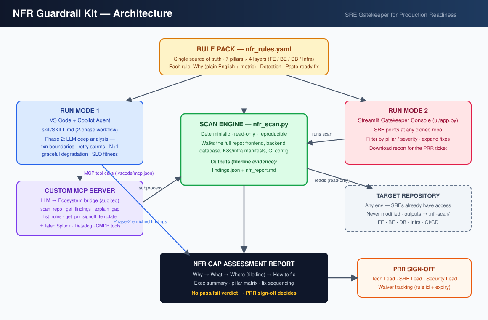
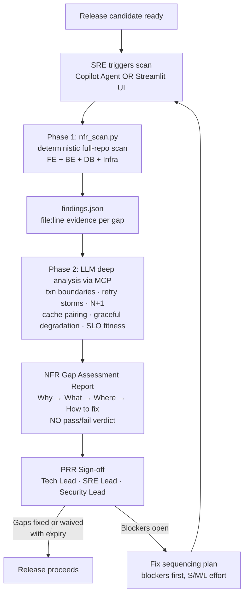

# 🛡️ NFR Guardrail Kit

> **Works with or without an LLM.** The rule pack carries the Why + Fix for every rule, so the deterministic scan and full report run standalone; the Copilot skill adds an optional deep-analysis layer on top.

**An SRE gatekeeper framework that finds Non-Functional Requirement gaps across the full stack — frontend, backend, database, and infra — *before* a release reaches production.**

Every finding answers four questions: **Why it matters → What the gap is → Where in the code (file:line) → How to fix it (paste-ready)**. The report never issues a pass/fail verdict — SREs act as the guardrail, and the release decision stays with the PRR (Production Readiness Review) sign-off group.

---

## Architecture



**The core design decision in plain English:** a deterministic program is cheap, reproducible, and never hallucinates a file:line — so it does the repo-wide pattern scanning. An LLM is expensive but can reason about transaction boundaries, retry-storm topology, and *"does the user journey survive if this dependency dies?"* — so it runs as a second phase on top of the machine findings. One rule pack (`nfr_rules.yaml`) is the single source of truth for both.

| Component | Path | Role |
|---|---|---|
| **Rule Pack** | `skill/rules/nfr_rules.yaml` | 24+ rules · 7 pillars × 4 layers · each rule = Why (plain English + metric) + detection + paste-ready fix |
| **Scan Engine** | `scanner/nfr_scan.py` | Deterministic, read-only repo walker → `findings.json` + `nfr_report.md` with file:line evidence |
| **Copilot Skill** | `skill/SKILL.md` | Run Mode 1 — 2-phase workflow inside VS Code + Copilot Agent: scanner first, then LLM deep analysis |
| **MCP Server** | `mcp/nfr_mcp_server.py` | The audited LLM ↔ ecosystem bridge: `scan_repo`, `get_findings`, `explain_gap`, `list_rules`, `get_prr_signoff_template` |
| **Gatekeeper UI** | `ui/app.py` | Run Mode 2 — Streamlit console: scan any repo, filter by pillar/severity, download the PRR report |
| **Report Contract** | `templates/report_template.md` | The exact output format both run modes follow |

### The 7 NFR pillars covered

Availability & HA · Reliability · Performance & Latency · Resilience & Defensive Architecture · Security & Governance · Observability & Telemetry · Deployment & Operability — each mapped to service tiers (Tier-1 99.99% / Tier-2 99.9% / Tier-3 99%).

---

## Workflow



**What Phase 2 catches that regex cannot** — the reasoning-level failures that only surface under real traffic:

1. `@Transactional` methods that wrap external HTTP calls (pool exhaustion + partial state)
2. `@Cacheable` without a paired `@CachePut`/`@CacheEvict` on the write path (stale data weeks later)
3. Multiplicative retry topology across layers (3×3×3 = one timeout becomes 27 calls — a self-inflicted DDoS)
4. Missing graceful degradation — which fallback is absent for each dependency
5. SLO fitness — can `replicas: 1` with no probes actually deliver a Tier-2 99.9% target? (No.)

---

## Usage

### Prerequisites

```bash
pip install pyyaml "mcp[cli]" streamlit
```

### Mode 0 — Direct CLI (fastest way to try it)

```bash
python scanner/nfr_scan.py /path/to/repo --out .nfr-scan
# → .nfr-scan/nfr_report.md   (human report, grouped by pillar)
# → .nfr-scan/findings.json   (machine findings for the LLM layer)
```

### Mode 1 — VS Code + Copilot Agent (SRE in the repo)

1. Copy `mcp/mcp.json` → `<workspace>/.vscode/mcp.json`
2. Open Copilot Chat in **Agent mode**
3. Ask: *"Scan this repo for NFR gaps and explain the blockers"*
4. Copilot calls `scan_repo` → `get_findings` → `explain_gap` through the MCP server, then applies `skill/SKILL.md` for the Phase-2 deep analysis and the full report

### Mode 2 — Gatekeeper UI, lightweight (Streamlit)

```bash
streamlit run ui/app.py
```

Point it at any cloned repo, run the scan, filter findings by pillar/severity, expand paste-ready fixes, and download the report to attach to the PRR ticket.

### Mode 3 — Enterprise Console (zero-LLM, VS Code integrated) 🏆

```bash
pip install fastapi uvicorn
python ui/enterprise/server.py     # → http://127.0.0.1:8787
```

A local web console designed for daily SRE gatekeeping — **no LLM anywhere**:

- **Repo Bundle** — register any repo by git URL with branches to track (develop/master/release); the console clones each branch locally, refreshes with `git fetch` on every scan, records history per repo+branch+commit, and shows **branch drift** (NFR debt difference between develop and release). Plain git + SQLite — no Sourcegraph license, no new infra
- **Product views** — *Overview*, *Repo Bundle*, *NFR Lens*, *Gaps* (grouped by category), *Recommendations* (deduped fix plan, blockers-first, copy-ready fixes), *History* (every scan by repo/branch/commit with filters), *Reports*, *NFR Dictionary* (34 terms, plain English + metric), *Copilot Prompts* (12 paste-ready prompts with copy buttons)
- **AI Insights (browser-LLM bridge)** — keyless LLM integration for the interim: the console builds a metadata-only analysis prompt from the scan (code evidence is explicit opt-in), the SRE pastes it into whatever LLM their browser already reaches, pastes the answer back, and the Deep Analysis is stored with the scan. Swaps to direct API calls the day keys are approved — same prompt, same storage, one function changes
- **SRE Knowledge Base** — 18 searchable reference articles (golden signals, SLO/burn-rate math, service tiers, incident severity matrix, first-15-minutes triage, blameless postmortems, resilience-pattern cheat sheet, observability triangle, canary/rollback discipline, PRR checklist, capacity sizing formulas, percentile literacy, DR drills/RTO-RPO, alert hygiene, dashboard standards, change discipline/DORA, FinOps for SRE) — the on-call shelf built into the product
- **Guardrail Assistant** — a floating chat agent for quick answers, fully deterministic (retrieval over the rule pack, dictionary, prompts, and live scan history) — works with zero LLM access
- **Release Gate strip** — a segmented severity bar per scan; click a segment to jump to those findings
- **Open in VS Code** — every finding deep-links via `vscode://file/<path>:<line>` straight to the offending line in your local editor
- **Scan history** — SQLite-backed, so NFR debt per repo is trackable over time
- **Exports** — Markdown report (for the PRR ticket), **SARIF** (load with the VS Code *SARIF Viewer* extension to annotate findings inline in the editor), and raw JSON

### Mode 4 — VS Code native task (zero-LLM, zero-UI)

Copy `vscode/tasks.json` → `<workspace>/.vscode/tasks.json`, then **Terminal → Run Task → NFR Guardrail Scan**. Findings appear as clickable entries in the **Problems panel** (via `--print-problems` + problem matcher) — jump to any file:line with one click.

### Extending the rule pack

Add a YAML block to `skill/rules/nfr_rules.yaml` — no code changes. The scanner, skill, MCP server, and UI all pick it up automatically. Convention: `PILLAR-LAYER-NNN`, and every rule must carry a plain-English `why` naming the production metric it protects.

---

## Why MCP (the "LLMs have no ecosystem access" answer)

That's the feature, not the limitation. MCP inverts the model from *"give the LLM access"* to *"the LLM asks **your** tools"*. Each `@mcp.tool` in `nfr_mcp_server.py` is a narrow, **read-only**, **audited** doorway you implement and control — every call is logged to `mcp/audit.log` with timestamp, tool, and arguments. The same server later gains `query_splunk`, `get_datadog_slo`, `get_service_tier` (CMDB) tools, turning it into a general, governance-friendly LLM↔ecosystem bridge for triage, RCA, and reporting.

---

## Benefits

| Benefit | Plain English | Metric it moves |
|---|---|---|
| **Shift-left incident prevention** | Gaps like missing timeouts and single-replica deploys are caught in review, not at 3 AM | Blocker-class incidents from scanned releases → target 0 |
| **Faster incident response by design** | Enforced correlation-ID logging, tracing, and health probes mean alert → trace → query in one hop | MTTD and MTTR reduction |
| **Consistent PRR discipline at velocity** | Same 7-pillar bar applied to every release automatically — Agile speed with NFR rigor | 100% of releases scanned; report in < 10 min |
| **Evidence, not opinion** | Every finding cites file:line; LLM-only findings are explicitly labeled "inferred" | 100% findings with evidence; false-positive rate < 15% |
| **Audit-ready AI adoption** | Read-only tools, logged calls, no verdicts, human sign-off — approvable in a regulated environment | 100% tool-call traceability |
| **NFR debt visibility** | Nightly org-wide scans roll up into a per-portfolio debt dashboard for leadership | NFR debt trending down quarter-over-quarter per tier |

---

## Governance guardrails (regulated-environment ready)

- **Read-only** — scanner and MCP tools never modify target repos; outputs land in `.nfr-scan/` only
- **Auditable** — every MCP tool call logged (timestamp, tool, args)
- **No verdicts** — reports identify gaps; the PRR sign-off matrix (Tech Lead / SRE Lead / Security Lead) decides; waivers tracked with rule id + expiry
- **Deterministic core** — machine findings are reproducible; the LLM layer only adds labeled, evidence-cited reasoning
- **Approved-stack alignment** — runs entirely inside VS Code + Copilot; the MCP server is your code on your infra

---

## Rollout plan

| Phase | Weeks | Do | Success metric |
|---|---|---|---|
| 1 — Pilot | 1–3 | Scan 3 volunteer repos (one per tier); tune rules, kill false positives | FP rate < 15%; 100% evidence-backed findings |
| 2 — Copilot mode | 4–6 | Ship skill + MCP server to the SRE team; scan every release candidate | 100% of pilot releases scanned; report < 10 min |
| 3 — UI + PRR wiring | 7–10 | Gatekeeper console live; report auto-attached to PRR ticket | Blockers caught pre-prod vs in-prod ratio |
| 4 — Ecosystem MCP | 11–16 | Add Splunk / Datadog / CMDB tools; correlate gaps with live SLO burn | MTTR reduction on scanned services |
| 5 — Scale | 16+ | Nightly org-wide scans; NFR debt dashboard to leadership | Debt down quarter-over-quarter per tier |

---

## Repository layout

```
nfr-guardrail-kit/
├── README.md                    ← you are here
├── docs/
│   └── architecture.svg         ← architecture diagram
├── skill/
│   ├── SKILL.md                 ← Copilot/Claude skill (2-phase workflow)
│   └── rules/nfr_rules.yaml     ← the rule pack (single source of truth)
├── scanner/
│   └── nfr_scan.py              ← deterministic scan engine
├── mcp/
│   ├── nfr_mcp_server.py        ← custom MCP server (LLM ↔ ecosystem bridge)
│   └── mcp.json                 ← VS Code / Copilot registration
├── ui/
│   ├── app.py                   ← Streamlit gatekeeper console (lightweight)
│   └── enterprise/
│       ├── server.py            ← FastAPI console: history, SARIF, exports
│       └── static/index.html    ← Release Gate SPA (vscode:// deep links)
├── vscode/

commands to use -
Get-ChildItem -Path $HOME\Downloads -Filter "*nfr*" -Directory

@workspace I have a zip file at ~/Downloads/nfr-scanner-update containing updated
scanner files. I need you to carefully merge these into my existing project
WITHOUT disturbing or overwriting anything else in my codebase.

Rules:
1. First, list every file inside ~/Downloads/nfr-scanner-update
2. For each file, check if it already exists in my project at the same relative path
3. If it's a NEW file (doesn't exist yet) — create it exactly as-is, no changes
4. If it ALREADY EXISTS — show me a diff between my current version and the new
   one BEFORE changing anything. Do not overwrite until I confirm.
5. Do NOT touch, delete, or modify any file that is not part of this update —
   my UI, console, reports, runbooks, and knowledge base files must stay
   completely untouched.
6. After every file is placed, run: python -m py_compile on every .py file
   that was added or changed, and confirm the rule count in
   skill/rules/nfr_rules.yaml equals 40.
7. Report back a summary: files created, files replaced, files skipped, and
   the verification results. Do not commit anything yet — wait for my
   confirmation.

8. Now commit these changes with an appropriate message and push to origin main.

9. @workspace Run: git status --porcelain

For every file listed as modified or deleted, check whether it's one of these:
scanner/nfr_scan.py, scanner/semantic/*.py, scanner/engines/*.py,
skill/rules/nfr_rules.yaml

If ANY other file shows as changed or deleted, stop and show me exactly what
changed in it before I go further. My console, reports, runbooks, and
knowledge base must show zero changes.


10.@workspace For each of these files, show me the first 5 lines and the total
line count:
scanner/semantic/exceptions.py
scanner/semantic/k8s.py
scanner/semantic/observability.py
scanner/semantic/report_model.py
scanner/engines/adapters.py

Compare against these expected line counts (approximate, within 20 lines is fine):
exceptions.py ~387, k8s.py ~322, observability.py ~381, report_model.py ~348,
adapters.py ~430

Flag any file that's significantly shorter than expected — that usually means
a truncated copy.


11. @workspace Run this exact test to prove the exception analyzer genuinely works,
not just that the file exists:

python -c "
import sys; sys.path.insert(0,'scanner')
from semantic import source, exceptions

code = '''
public class T {
    public void bad() { try { risky(); } catch (Exception e) { } }
}
'''
with open('_tmp_test.java','w') as f: f.write(code)
import pathlib
s = source.load(pathlib.Path('_tmp_test.java'))
findings = exceptions.analyse(s)
print(f'{len(findings)} finding(s) — expect 1 (empty catch block, blocker severity)')
if findings: print(findings[0]['rule_id'], findings[0]['severity'])
"

Then delete _tmp_test.java. Report the exact output.


12. @workspace Run:
python -c "
import yaml
r = yaml.safe_load(open('skill/rules/nfr_rules.yaml'))['rules']
print('total:', len(r))
new_ids = ['REL-DB-010','PERF-DB-010','PERF-DB-011','AVL-INF-020','GOV-ALL-001','GOV-ALL-002']
found = [x['id'] for x in r if x['id'] in new_ids]
print('estate rules present:', found)
"

Expect total: 40, and all 6 IDs listed as present.


13. @workspace Summarise:
1. Which files were created (should be new, zero prior version)
2. Which files were replaced (should be exactly 2: nfr_scan.py and nfr_rules.yaml)
3. The output of the exception-analyzer test above
4. The output of the rule-count check above
5. Confirm git status shows ONLY these files as changed, nothing else

Do not commit yet. Wait for my explicit go-ahead.
